# Data Flow Diagram - Context Diagram (Level 0)

## Overview
The Context Diagram represents the highest level view of the OCC Enrollment System, showing the system as a single process and its interactions with external entities.

## System Boundary
The OCC Enrollment System manages the complete student enrollment lifecycle from initial registration through graduation, including curriculum management, enrollment processing, document verification, grade management, and reporting.

## External Entities

1. **Student** - Primary user who registers, applies for enrollment, uploads documents, views schedules and grades
2. **Admin/Registrar** - System administrator who manages users, curriculum, sections, schedules, approves enrollments, generates CORs, and manages grades
3. **Admission Officer** - Handles applicant processing, document verification, student number assignment, and enrollment control
4. **Program Head** - Submits curriculum proposals for their respective programs
5. **Dean** - Reviews and approves curriculum submissions, views enrollment reports
6. **Registrar Staff** - Assists with enrollment processes and administrative tasks

## Data Flows

### Student ↔ System
- **Student Registration Data** → System (name, email, password, personal information)
- **Application Data** → System (program selection, personal details, educational background)
- **Document Uploads** → System (scanned documents: birth certificate, diploma, etc.)
- **Enrollment Request** → System (subject selections, section preferences)
- **Login Credentials** → System (email, password)
- **Query** → System (chatbot questions)
- **System** → Student Account Status (pending/active/inactive)
- **System** → Student Schedule (class schedules, sections)
- **System** → Student Grades (academic performance)
- **System** → Student COR (Certificate of Registration)
- **System** → Student Enrollment Status (enrolled/pending)
- **System** → Chatbot Response (FAQ answers)

### Admin/Registrar ↔ System
- **User Management Commands** → System (approve/reject users, update status)
- **Curriculum Management** → System (add/edit curriculum courses, manage prerequisites)
- **Section Management** → System (create sections, assign students)
- **Schedule Management** → System (create/update class schedules)
- **Enrollment Approval** → System (approve/reject enrollment requests)
- **Grade Entry** → System (enter/update student grades)
- **COR Generation Request** → System (generate certificate of registration)
- **System** → User List (all students and their status)
- **System** → Enrollment Reports (statistics, analytics)
- **System** → Curriculum Data (all courses and programs)
- **System** → Section Information (sections and enrollments)
- **System** → Grade Reports (student performance data)

### Admission Officer ↔ System
- **Document Verification** → System (verify/reject uploaded documents)
- **Student Number Assignment** → System (assign student IDs)
- **Enrollment Control** → System (open/close enrollment periods)
- **Applicant Processing** → System (update applicant status, pass to registrar)
- **System** → Applicant List (pending applicants)
- **System** → Document Status (verification results)
- **System** → Enrollment Control Status (current enrollment period status)

### Program Head ↔ System
- **Curriculum Submission** → System (proposed curriculum changes)
- **Login Credentials** → System (email, password)
- **System** → Curriculum Submission Status (pending/approved/rejected)
- **System** → Program Data (program-specific information)

### Dean ↔ System
- **Curriculum Approval** → System (approve/reject curriculum submissions)
- **Login Credentials** → System (email, password)
- **System** → Curriculum Submissions (pending approvals)
- **System** → Enrollment Reports (institutional reports)

### Registrar Staff ↔ System
- **Enrollment Assistance** → System (help process enrollments)
- **Login Credentials** → System (email, password)
- **System** → Enrollment Data (student enrollment information)

## Mermaid Diagram

```mermaid
graph TB
    Student[Student]
    Admin[Admin/Registrar]
    Admission[Admission Officer]
    ProgramHead[Program Head]
    Dean[Dean]
    RegistrarStaff[Registrar Staff]
    System[OCC Enrollment System]
    
    Student -->|Student Registration Data| System
    Student -->|Application Data| System
    Student -->|Document Uploads| System
    Student -->|Enrollment Request| System
    Student -->|Login Credentials| System
    Student -->|Query| System
    
    System -->|Account Status| Student
    System -->|Student Schedule| Student
    System -->|Student Grades| Student
    System -->|Student COR| Student
    System -->|Enrollment Status| Student
    System -->|Chatbot Response| Student
    
    Admin -->|User Management Commands| System
    Admin -->|Curriculum Management| System
    Admin -->|Section Management| System
    Admin -->|Schedule Management| System
    Admin -->|Enrollment Approval| System
    Admin -->|Grade Entry| System
    Admin -->|COR Generation Request| System
    
    System -->|User List| Admin
    System -->|Enrollment Reports| Admin
    System -->|Curriculum Data| Admin
    System -->|Section Information| Admin
    System -->|Grade Reports| Admin
    
    Admission -->|Document Verification| System
    Admission -->|Student Number Assignment| System
    Admission -->|Enrollment Control| System
    Admission -->|Applicant Processing| System
    
    System -->|Applicant List| Admission
    System -->|Document Status| Admission
    System -->|Enrollment Control Status| Admission
    
    ProgramHead -->|Curriculum Submission| System
    ProgramHead -->|Login Credentials| System
    
    System -->|Curriculum Submission Status| ProgramHead
    System -->|Program Data| ProgramHead
    
    Dean -->|Curriculum Approval| System
    Dean -->|Login Credentials| System
    
    System -->|Curriculum Submissions| Dean
    System -->|Enrollment Reports| Dean
    
    RegistrarStaff -->|Enrollment Assistance| System
    RegistrarStaff -->|Login Credentials| System
    
    System -->|Enrollment Data| RegistrarStaff
    
    style System fill:#e1f5ff,stroke:#01579b,stroke-width:3px
    style Student fill:#fff3e0,stroke:#e65100
    style Admin fill:#f3e5f5,stroke:#4a148c
    style Admission fill:#e8f5e9,stroke:#1b5e20
    style ProgramHead fill:#fff9c4,stroke:#f57f17
    style Dean fill:#fce4ec,stroke:#880e4f
    style RegistrarStaff fill:#e0f2f1,stroke:#004d40
```

## Notes

- The Context Diagram shows the system as a single black box
- All external entities are shown as rectangles
- Data flows are bidirectional where appropriate
- The system handles authentication for all user types
- All data flows represent logical data, not physical implementation details

