# Data Flow Diagram - Level 0 DFD

## Overview
The Level 0 DFD decomposes the OCC Enrollment System into major processes, showing how data flows between processes, external entities, and data stores.

## Major Processes

1. **1.0 User Management** - Handles user registration, authentication, and account management
2. **2.0 Application Processing** - Manages student applications, document verification, and applicant workflow
3. **3.0 Curriculum Management** - Handles curriculum submissions, reviews, and approvals
4. **4.0 Enrollment Processing** - Manages enrollment requests, section assignments, and schedule creation
5. **5.0 Grade Management** - Handles grade entry, verification, and viewing
6. **6.0 Document Management** - Manages document uploads, verification, and status updates
7. **7.0 Reporting** - Generates enrollment reports and analytics
8. **8.0 Chatbot Service** - Processes queries and provides FAQ responses

## Data Stores

- **D1: Users** - Student and user account information
- **D2: Admins** - Administrator accounts
- **D3: Admissions** - Admission officer accounts
- **D4: Program Heads** - Program head accounts
- **D5: Applicants** - Applicant information and status
- **D6: Enrolled Students** - Enrolled student records
- **D7: Curriculum** - Course curriculum data
- **D8: Curriculum Submissions** - Curriculum submission records
- **D9: Sections** - Section information
- **D10: Section Enrollments** - Student-section assignments
- **D11: Schedules** - Section schedules (section_schedules)
- **D12: Student Schedules** - Individual student schedules
- **D13: Documents** - Document uploads and verification status
- **D14: Student Grades** - Student grade records
- **D15: Certificate of Registration** - Generated COR records
- **D16: Enrollment Control** - Enrollment period control
- **D17: Chatbot FAQs** - FAQ database
- **D18: Chatbot History** - Chatbot interaction history
- **D19: Enrollment Reports** - Generated enrollment reports

## Data Flows

### Process 1.0: User Management
- **Inputs:**
  - Student Registration Data (from Student)
  - Login Credentials (from Student, Admin, Admission, Program Head, Dean, Registrar Staff)
  - User Management Commands (from Admin)
- **Outputs:**
  - Account Status (to Student)
  - User List (to Admin)
- **Data Stores:**
  - Reads/Writes: D1 (Users)
  - Reads: D2 (Admins), D3 (Admissions), D4 (Program Heads)

### Process 2.0: Application Processing
- **Inputs:**
  - Application Data (from Student)
  - Document Verification (from Admission)
  - Student Number Assignment (from Admission)
  - Applicant Processing (from Admission)
- **Outputs:**
  - Applicant List (to Admission)
  - Enrollment Status (to Student)
- **Data Stores:**
  - Reads/Writes: D5 (Applicants), D1 (Users)
  - Reads: D16 (Enrollment Control)

### Process 3.0: Curriculum Management
- **Inputs:**
  - Curriculum Submission (from Program Head)
  - Curriculum Management (from Admin)
  - Curriculum Approval (from Dean)
- **Outputs:**
  - Curriculum Submission Status (to Program Head)
  - Curriculum Data (to Admin)
  - Curriculum Submissions (to Dean)
- **Data Stores:**
  - Reads/Writes: D7 (Curriculum), D8 (Curriculum Submissions)
  - Reads: D4 (Program Heads), D2 (Admins)

### Process 4.0: Enrollment Processing
- **Inputs:**
  - Enrollment Request (from Student)
  - Section Management (from Admin)
  - Schedule Management (from Admin)
  - Enrollment Approval (from Admin)
- **Outputs:**
  - Student Schedule (to Student)
  - Section Information (to Admin)
  - Student COR (to Student)
- **Data Stores:**
  - Reads/Writes: D6 (Enrolled Students), D9 (Sections), D10 (Section Enrollments), D11 (Schedules), D12 (Student Schedules), D15 (Certificate of Registration)
  - Reads: D7 (Curriculum), D1 (Users), D14 (Student Grades)

### Process 5.0: Grade Management
- **Inputs:**
  - Grade Entry (from Admin)
- **Outputs:**
  - Student Grades (to Student)
  - Grade Reports (to Admin)
- **Data Stores:**
  - Reads/Writes: D14 (Student Grades)
  - Reads: D1 (Users), D12 (Student Schedules)

### Process 6.0: Document Management
- **Inputs:**
  - Document Uploads (from Student)
  - Document Verification (from Admission)
- **Outputs:**
  - Document Status (to Admission)
- **Data Stores:**
  - Reads/Writes: D13 (Documents)
  - Reads: D1 (Users)

### Process 7.0: Reporting
- **Inputs:**
  - COR Generation Request (from Admin)
- **Outputs:**
  - Enrollment Reports (to Admin, Dean)
- **Data Stores:**
  - Reads: D6 (Enrolled Students), D9 (Sections), D10 (Section Enrollments), D1 (Users)
  - Reads/Writes: D19 (Enrollment Reports), D15 (Certificate of Registration)

### Process 8.0: Chatbot Service
- **Inputs:**
  - Query (from Student)
- **Outputs:**
  - Chatbot Response (to Student)
- **Data Stores:**
  - Reads: D17 (Chatbot FAQs)
  - Reads/Writes: D18 (Chatbot History)

## Mermaid Diagram

```mermaid
graph TB
    Student[Student]
    Admin[Admin/Registrar]
    Admission[Admission Officer]
    ProgramHead[Program Head]
    Dean[Dean]
    RegistrarStaff[Registrar Staff]
    
    P1[1.0<br/>User Management]
    P2[2.0<br/>Application Processing]
    P3[3.0<br/>Curriculum Management]
    P4[4.0<br/>Enrollment Processing]
    P5[5.0<br/>Grade Management]
    P6[6.0<br/>Document Management]
    P7[7.0<br/>Reporting]
    P8[8.0<br/>Chatbot Service]
    
    D1[("D1: Users")]
    D2[("D2: Admins")]
    D3[("D3: Admissions")]
    D4[("D4: Program Heads")]
    D5[("D5: Applicants")]
    D6[("D6: Enrolled Students")]
    D7[("D7: Curriculum")]
    D8[("D8: Curriculum Submissions")]
    D9[("D9: Sections")]
    D10[("D10: Section Enrollments")]
    D11[("D11: Schedules")]
    D12[("D12: Student Schedules")]
    D13[("D13: Documents")]
    D14[("D14: Student Grades")]
    D15[("D15: Certificate of Registration")]
    D16[("D16: Enrollment Control")]
    D17[("D17: Chatbot FAQs")]
    D18[("D18: Chatbot History")]
    D19[("D19: Enrollment Reports")]
    
    Student -->|Student Registration Data| P1
    Student -->|Application Data| P2
    Student -->|Document Uploads| P6
    Student -->|Enrollment Request| P4
    Student -->|Login Credentials| P1
    Student -->|Query| P8
    
    P1 -->|Account Status| Student
    P2 -->|Enrollment Status| Student
    P4 -->|Student Schedule| Student
    P4 -->|Student COR| Student
    P5 -->|Student Grades| Student
    P8 -->|Chatbot Response| Student
    
    Admin -->|User Management Commands| P1
    Admin -->|Curriculum Management| P3
    Admin -->|Section Management| P4
    Admin -->|Schedule Management| P4
    Admin -->|Enrollment Approval| P4
    Admin -->|Grade Entry| P5
    Admin -->|COR Generation Request| P7
    
    P1 -->|User List| Admin
    P3 -->|Curriculum Data| Admin
    P4 -->|Section Information| Admin
    P5 -->|Grade Reports| Admin
    P7 -->|Enrollment Reports| Admin
    
    Admission -->|Document Verification| P6
    Admission -->|Student Number Assignment| P2
    Admission -->|Enrollment Control| P2
    Admission -->|Applicant Processing| P2
    
    P2 -->|Applicant List| Admission
    P6 -->|Document Status| Admission
    P2 -->|Enrollment Control Status| Admission
    
    ProgramHead -->|Curriculum Submission| P3
    ProgramHead -->|Login Credentials| P1
    
    P3 -->|Curriculum Submission Status| ProgramHead
    P1 -->|Program Data| ProgramHead
    
    Dean -->|Curriculum Approval| P3
    Dean -->|Login Credentials| P1
    
    P3 -->|Curriculum Submissions| Dean
    P7 -->|Enrollment Reports| Dean
    
    RegistrarStaff -->|Enrollment Assistance| P4
    RegistrarStaff -->|Login Credentials| P1
    
    P4 -->|Enrollment Data| RegistrarStaff
    
    P1 <--> D1
    P1 --> D2
    P1 --> D3
    P1 --> D4
    
    P2 <--> D5
    P2 <--> D1
    P2 --> D16
    
    P3 <--> D7
    P3 <--> D8
    P3 --> D4
    P3 --> D2
    
    P4 <--> D6
    P4 <--> D9
    P4 <--> D10
    P4 <--> D11
    P4 <--> D12
    P4 <--> D15
    P4 --> D7
    P4 --> D1
    P4 --> D14
    
    P5 <--> D14
    P5 --> D1
    P5 --> D12
    
    P6 <--> D13
    P6 --> D1
    
    P7 --> D6
    P7 --> D9
    P7 --> D10
    P7 --> D1
    P7 <--> D19
    P7 <--> D15
    
    P8 --> D17
    P8 <--> D18
    
    style P1 fill:#e3f2fd,stroke:#1976d2
    style P2 fill:#e8f5e9,stroke:#388e3c
    style P3 fill:#fff3e0,stroke:#f57c00
    style P4 fill:#f3e5f5,stroke:#7b1fa2
    style P5 fill:#fce4ec,stroke:#c2185b
    style P6 fill:#e0f2f1,stroke:#00796b
    style P7 fill:#fff9c4,stroke:#f9a825
    style P8 fill:#e1bee7,stroke:#8e24aa
```

## Notes

- Processes are numbered sequentially (1.0, 2.0, etc.)
- Data stores use open rectangles (Yourdon/DeMarco notation)
- All data flows are labeled
- Processes can read from and write to data stores
- External entities are shown as rectangles
- The diagram shows the logical flow of data, not physical implementation

