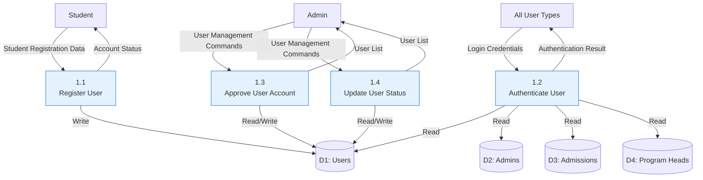
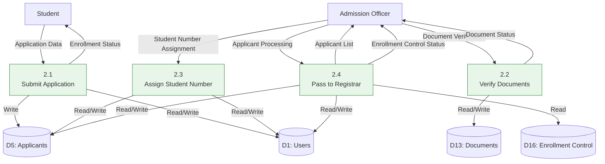
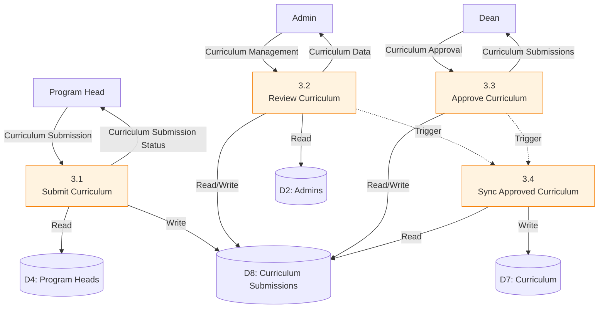
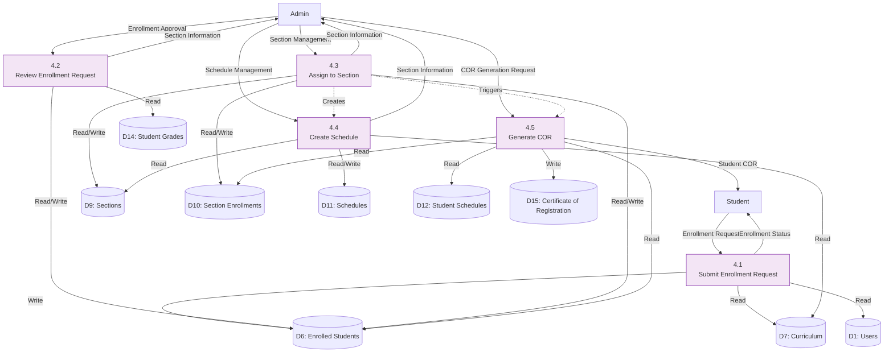
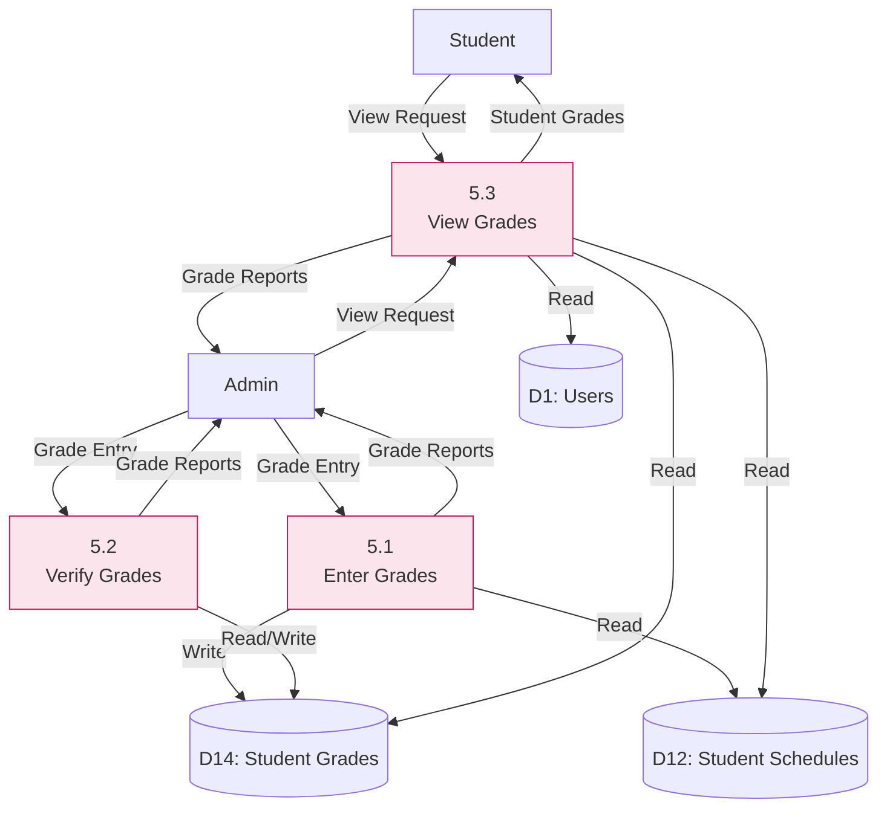
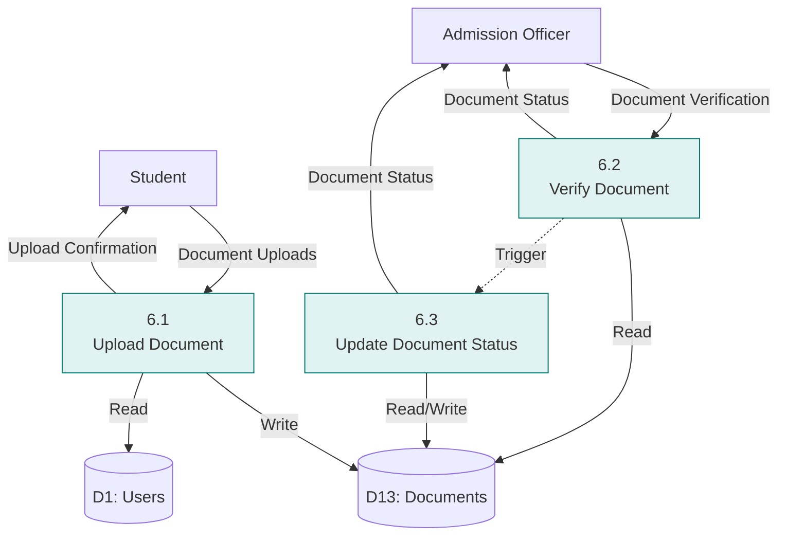
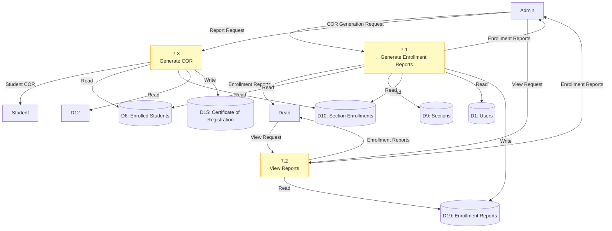
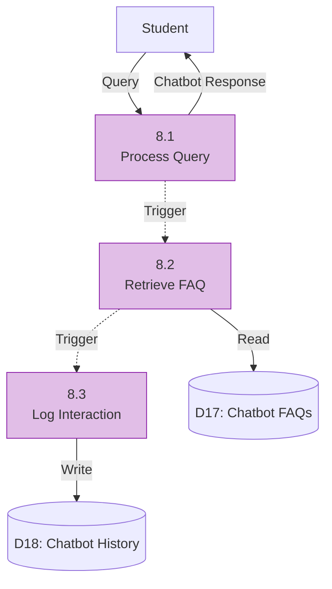

# Data Flow Diagram - Level 1 DFDs

## Overview
Level 1 DFDs provide detailed breakdowns of each major process from the Level 0 DFD, showing sub-processes and their interactions with data stores and external entities.

---

## 1.0 User Management (Level 1)

### Sub-Processes
- **1.1 Register User** - Creates new user accounts (students)
- **1.2 Authenticate User** - Validates login credentials for all user types
- **1.3 Approve User Account** - Admin approves/rejects pending student accounts
- **1.4 Update User Status** - Admin updates user account status (active/inactive)

### Data Flows
- **Inputs:**
  - Student Registration Data → 1.1
  - Login Credentials → 1.2 (from all user types)
  - User Management Commands → 1.3, 1.4
- **Outputs:**
  - Account Status → Student
  - User List → Admin
  - Authentication Result → All users

### Mermaid Diagram

---

## 2.0 Application Processing (Level 1)

### Sub-Processes
- **2.1 Submit Application** - Student submits enrollment application
- **2.2 Verify Documents** - Admission verifies uploaded documents
- **2.3 Assign Student Number** - Admission assigns unique student ID
- **2.4 Pass to Registrar** - Admission passes verified applicants to registrar

### Data Flows
- **Inputs:**
  - Application Data → 2.1
  - Document Verification → 2.2
  - Student Number Assignment → 2.3
  - Applicant Processing → 2.4
- **Outputs:**
  - Applicant List → Admission
  - Enrollment Status → Student
  - Enrollment Control Status → Admission

### Mermaid Diagram

---

## 3.0 Curriculum Management (Level 1)

### Sub-Processes
- **3.1 Submit Curriculum** - Program Head submits curriculum proposals
- **3.2 Review Curriculum** - Admin reviews curriculum submissions
- **3.3 Approve Curriculum** - Dean approves/rejects curriculum submissions
- **3.4 Sync Approved Curriculum** - System syncs approved curriculum to main curriculum table

### Data Flows
- **Inputs:**
  - Curriculum Submission → 3.1
  - Curriculum Management → 3.2
  - Curriculum Approval → 3.3
- **Outputs:**
  - Curriculum Submission Status → Program Head
  - Curriculum Data → Admin
  - Curriculum Submissions → Dean

### Mermaid Diagram

---

## 4.0 Enrollment Processing (Level 1)

### Sub-Processes
- **4.1 Submit Enrollment Request** - Student submits enrollment request for next semester
- **4.2 Review Enrollment Request** - Admin/Registrar reviews enrollment requests
- **4.3 Assign to Section** - Admin assigns student to section
- **4.4 Create Schedule** - Admin creates section schedules
- **4.5 Generate COR** - System generates Certificate of Registration

### Data Flows
- **Inputs:**
  - Enrollment Request → 4.1
  - Section Management → 4.3
  - Schedule Management → 4.4
  - Enrollment Approval → 4.2
  - COR Generation Request → 4.5
- **Outputs:**
  - Student Schedule → Student
  - Section Information → Admin
  - Student COR → Student

### Mermaid Diagram

---

## 5.0 Grade Management (Level 1)

### Sub-Processes
- **5.1 Enter Grades** - Admin enters student grades
- **5.2 Verify Grades** - Admin verifies entered grades
- **5.3 View Grades** - Students and admins view grades

### Data Flows
- **Inputs:**
  - Grade Entry → 5.1, 5.2
- **Outputs:**
  - Student Grades → Student
  - Grade Reports → Admin

### Mermaid Diagram

---

## 6.0 Document Management (Level 1)

### Sub-Processes
- **6.1 Upload Document** - Student uploads required documents
- **6.2 Verify Document** - Admission verifies uploaded documents
- **6.3 Update Document Status** - System updates document verification status

### Data Flows
- **Inputs:**
  - Document Uploads → 6.1
  - Document Verification → 6.2
- **Outputs:**
  - Document Status → Admission

### Mermaid Diagram

---

## 7.0 Reporting (Level 1)

### Sub-Processes
- **7.1 Generate Enrollment Reports** - System generates various enrollment reports
- **7.2 View Reports** - Admins and Deans view generated reports
- **7.3 Generate COR** - System generates Certificate of Registration (also part of 4.5)

### Data Flows
- **Inputs:**
  - COR Generation Request → 7.3
  - Report Request → 7.1
- **Outputs:**
  - Enrollment Reports → Admin, Dean
  - Student COR → Student

### Mermaid Diagram

---

## 8.0 Chatbot Service (Level 1)

### Sub-Processes
- **8.1 Process Query** - System processes user query
- **8.2 Retrieve FAQ** - System retrieves matching FAQ
- **8.3 Log Interaction** - System logs chatbot interaction

### Data Flows
- **Inputs:**
  - Query → 8.1
- **Outputs:**
  - Chatbot Response → Student

### Mermaid Diagram

---

## Notes

- Level 1 DFDs show detailed sub-processes for each major process
- Dotted lines indicate control flows or triggers
- Each sub-process maintains the same data store relationships as its parent process
- Processes are numbered hierarchically (e.g., 1.1, 1.2 under process 1.0)
- All data flows are labeled with descriptive names

